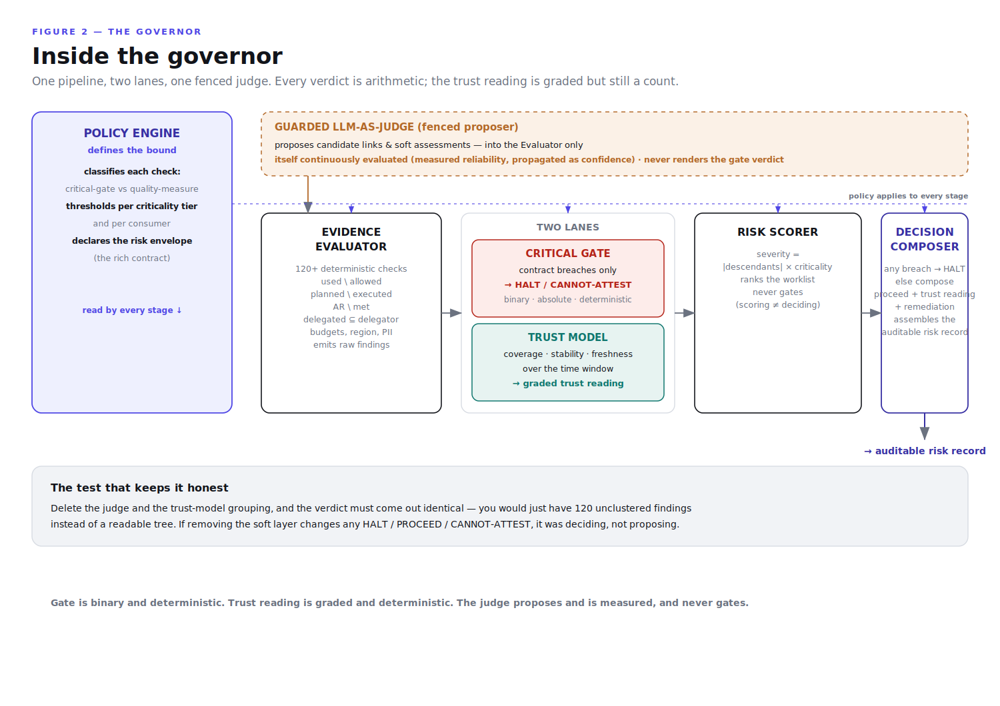

# deterministic-governance-trace-gap

**Deterministic governance for probabilistic systems.**

Everyone is shipping agents. Almost no one is shipping the brake.

The usual way to govern an AI system is to put another model in charge of watching it. That is a leash made of the same material as the thing it restrains: it can be flattered, it drifts, and it is not reproducible. This is the other kind of leash.

```
AGENT      "I completed payroll."

GOVERNOR   ✓ correct employee
           ✓ approved account
           ✓ authorized amount
           ✗ contract exceeded
           ─────────────────────
           HALT      one failed check is enough.
```

## Quickstart

```bash
git clone https://github.com/MaddySah/deterministic-governance-trace-gap.git
cd deterministic-governance-trace-gap
python -m src.demo        # standard library only. No install, no keys, no network.
```

Runs in under a second on synthetic fixtures with *planted* faults. Run it twice and the `audit_hash` is identical — reproducible to the bit.

## The three commitments

**1. Critical failures are deterministic and absolute.** A contract breach is a set difference that either fired or did not. When it fires, the run halts. No score, no window, no "mostly."

**2. Everything else is a measured trust reading, not pass/fail.** Most of what a system produces is not a breach; it is a quality gradient. We do not claim the system is correct at all times. We measure where it stands in this window so the decision to proceed is informed rather than assumed. And graded is *not* probabilistic: 86% coverage is a count, not a model's opinion. Both lanes stay deterministic.

**3. An LLM judge is permitted only if it is evaluated, bounded, and never trusted to render the verdict.** A judge you have measured is an instrument. A judge you assume is a liability. The difference is the evaluation.

> **Soft proposes. Counting decides. Structure ranks.**
> **Out-of-bound = contract breach = deterministic failure.**

## Claims and evidence are different objects

They do not share a schema, because they do not share a spine.

| | **Claims** (`policy.py`) | **Evidence** (`evidence.py`) |
|---|---|---|
| nature | declared | observed |
| carries | intent, requirement, priority, criticality, contract_ref | source, timestamp, lineage, run_ref |
| trust question | authority & staleness | authenticity & freshness |

**Evidence with no establishable provenance cannot substantiate a claim.** That is not a slogan; it is a check. Unprovenanced evidence is not passed and not failed — it is routed to CANNOT-ATTEST, because we cannot say where it came from.

## Two lanes, one fenced judge



The Policy Engine defines the bound and classifies each check. The Evidence Evaluator counts — it is the arithmetic core, and there is no model in it. The findings split into two lanes: contract breaches go to the **critical gate** (binary, absolute, `HALT`), and everything else feeds the **trust model** (graded, informs, never gates). The Risk Scorer ranks by blast radius but never decides. The Decision Composer renders the verdict and seals the record.

The full system architecture — sources, integration, the delivery and orchestration layers, and where enforcement plugs in — is in [`docs/design.md`](docs/design.md).

## The contract is a risk envelope

Not an allow-list. The full operating boundary of a step (`src/policy.py`):

```python
Contract(
    allowed_tools, satisfies, may_delegate_to,   # gates: crossing = breach
    cost_budget, latency_budget_ms,              # gates
    allowed_regions, pii_allowed,                # gates
    expected_quality, expected_confidence,       # measures: degrade the reading
    verifiable,                                  # can success be checked at all?
)
```

## The arithmetic

```
tool scope        used(step) \ allowed(step)
delegation        delegated_to \ may_delegate_to      ← privilege escalation by proxy
plan conformance  planned \ executed   and   executed \ planned
budgets           cost > budget · latency > budget
residency / PII    region ∉ allowed · handled_pii ∧ ¬pii_allowed
coverage          AR \ met
provenance        evidence without lineage cannot substantiate
severity          |descendants(node)| × criticality   ← ranks, never gates
```

Retries are counted, not collapsed: a breach on *any* attempt is a breach, even if a later attempt was clean. The agent's own self-critique and reported confidence are carried into the record but never counted as evidence that a requirement was met — an agent grading itself is the forbidden configuration.

## The output is an auditable risk record

Not a boolean. A record that carries its own evidence:

```json
{
  "verdict": "HALT",
  "reasoning": "10 critical contract breach(es). Highest: tool_scope on pull_credit.",
  "evidence_ids": ["pull_credit#a1", "score#a1", "..."],
  "policy_ids": ["pull_credit", "score", "..."],
  "confidence": 0.42,
  "risk": 1.0,
  "suggested_remediation": ["pull_credit: revoke the out-of-scope tool or widen the contract"],
  "trust": {"applicant_comms": 0.0, "compliance_audit": 0.33, "decision_log": 0.3},
  "audit_hash": "sha256:2eea901c6f9912d8"
}
```

`evidence_ids` and `policy_ids` make "evidence-based" literal: every verdict traces to the exact evidence and the exact policy that produced it. `audit_hash` seals the record so it is tamper-evident.

## The test that keeps it honest

**Delete the judge and the verdict must come out identical.** A soft layer may cluster a hundred findings into a readable tree and propose links across the natural-language seam — it changes what the operator *sees*. It must never change what the gate *decides*. If removing it changes any HALT, PROCEED, or CANNOT-ATTEST, it was deciding, not proposing, and it goes back behind the fence.

There is no model in this repo. That is the point: the arithmetic core is a place a judge structurally cannot reach.

## What the demo shows

**Part A — static conformance.** A code change: coverage as a ratio, gaps ranked by blast radius, and orphan implementations (code answering to no requirement).

**Part B — an agent orchestration run.** A loan pre-screening under FCRA-style constraints, with a planted fault for every check: an out-of-scope tool call, a delegation to a sub-agent it may not use, a skipped adverse-action notice, an unplanned step, a blown cost budget, evidence with no provenance, and a free-text step it refuses to judge. Ends in a per-consumer trust reading and a sealed risk record.

## Layout

```
src/policy.py         the Policy Engine: contracts (risk envelope) + critical/quality lanes
src/evidence.py       evidence with first-class provenance; the observed run
src/orchestration.py  the declared plan (claims) and the actual run (evidence)
src/agent_assess.py   the Evidence Evaluator: the arithmetic core. No model, by construction.
src/verdict.py        the Decision Composer: two lanes → the auditable risk record
src/graph.py          dependency / orchestration DAG + blast radius
src/claims.py         static case: requirements, evidence, module graph
src/conformance.py    static arithmetic: anti-join gaps, coverage, orphans
src/demo.py           end to end, in two parts

docs/band-of-pseudo-control.md   the essay: why arithmetic, not oracles
docs/design.md                   the full design doc
docs/agent-orchestration.md      applying the pattern to orchestration layers
```

## What it refuses to claim

The refusal list is the credibility. trace-gap does **not** assert that a flagged item is definitely a defect (it is a candidate for review), that an unflagged item is safe (absence of evidence is not evidence of correctness), that an agent's reasoning or an internal code path is correct (it checks endpoints and correspondence, not paths), that the system is correct at all times (it measures where quality stands in a window, and says so), or any semantic verdict where a model would be both proposer and judge (forbidden by construction).

Most tools in this space overclaim exactly those five things. A system that structurally cannot is the rarer and more trustworthy artifact.

## Status

A clean-room reference implementation on synthetic data, built to make the design legible and runnable. Enforcement — binding the risk record to a change gate, a release gate, or an action pre-authorization — is a separate concern and deliberately not here: the record is platform-neutral, so the enforcer is a thin adapter.

## License

MIT.
