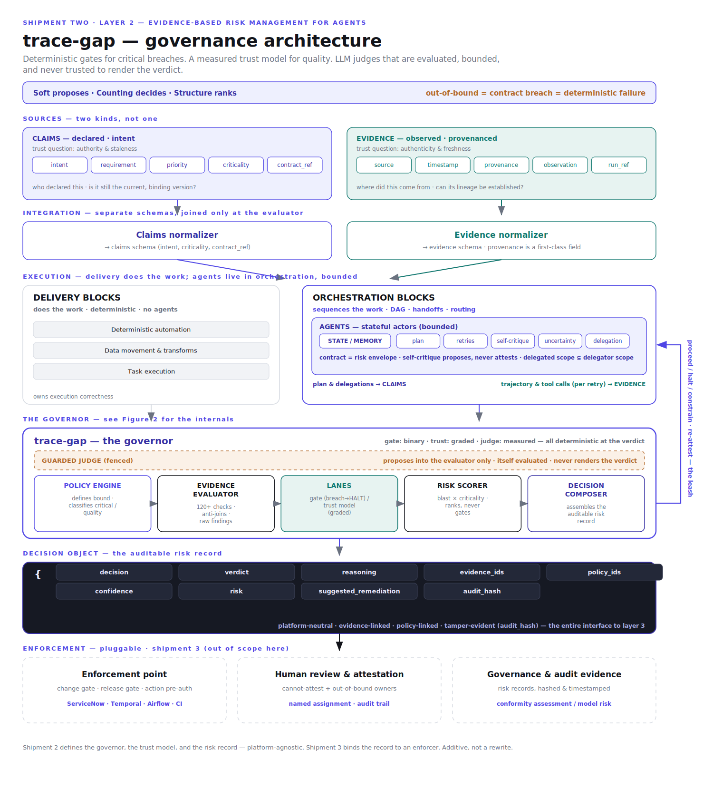

# trace-gap — design

**Evidence-based risk management for agentic systems.**

Deterministic gates for critical breaches. A measured trust model for graded quality. LLM judges that are evaluated, bounded, and never trusted to render the verdict.

---

## The thesis

Everyone is shipping agentic automation. Almost no one is shipping the brake.

The pitch for agents is that they act on their own. The problem with agents is that they act on their own. The usual answer is to put another model in charge of watching the first one, which is a leash made of the same material as the thing it restrains: it can be flattered, it drifts, and it is not reproducible.

This is a design for the other kind of leash. It rests on three commitments:

**1. Critical failures are deterministic and absolute.** A contract breach is not a judgment call. It is a set difference that either fired or did not, and when it fires the run halts. No score, no window, no "mostly."

**2. Everything else is a measured trust reading, not pass/fail.** Most of what a system produces is not a breach; it is a quality gradient. We do not claim the system is correct at all times. We measure where it stands in this window so the decision to proceed is informed rather than assumed.

**3. LLM judges are permitted, but only when they are evaluated, bounded, and never trusted to render the verdict.** A judge you have measured and fenced is a legitimate evidence source. A judge you trust blindly is the thing to refuse. The difference is the evaluation.

> **Soft proposes. Counting decides. Structure ranks.**
> **Out-of-bound = contract breach = deterministic failure.**

---

## The architecture



Reading it top to bottom: sources split into **claims** and **evidence** (two kinds, not one). Integration normalizes each into its own schema. Execution splits into **delivery blocks** (which do the work, deterministically, with no agents) and **orchestration blocks** (which sequence the work, and where agents live, bounded). The **governor** renders the verdict. **Enforcement** is pluggable and deliberately out of scope.

---

## Claims and evidence are different objects

They do not share a schema, because they do not share a spine.

**Claims are declared. They carry intent.** A requirement, its priority, its criticality, the contract it references. The trust question for a claim is *authority and staleness*: who declared this, and is it still the current, binding version? A claim can rot — superseded, unratified, quietly out of date — and a stale claim is a governance problem.

**Evidence is observed. It carries provenance.** A source, a timestamp, a lineage, the run that produced it. The trust question for evidence is *authenticity and freshness*: where did this come from, and can its lineage be established?

The hard consequence, implemented as a real check in `src/evidence.py` and `src/agent_assess.py`:

> **Evidence with no establishable provenance cannot substantiate a claim.**

Unprovenanced evidence is not counted as passing and not counted as failing. It routes to CANNOT-ATTEST, because we cannot say where it came from. Absence of provenance is an *integrity* problem, distinct from a stale claim, which is a *governance* problem.

Criticality lives on the claim, because criticality is a property of intent, not of observation. That single placement is what lets policy decide, per requirement, what is fatal and what is merely a quality compromise.

---

## Agents are stateful actors, not stateless functions

A bounded agent is not "a box with an allow-list." It carries state and memory, and five behaviors that each have governance consequences:

- **Planning.** The agent proposes a plan. That plan is itself a claim the governor checks against the declared plan.
- **Retries.** The same step runs more than once. A clean third attempt does **not** paper over an out-of-scope first one. A breach on any attempt is still a breach — so attempts are counted individually, never collapsed.
- **Self-critique.** The agent judges its own output. This is a soft proposal and it is fenced: it may inform the agent's next action, but it is never accepted as evidence that a requirement was met. An agent grading itself is the forbidden configuration.
- **Uncertainty.** The agent reports low confidence. This biases toward CANNOT-ATTEST and is *carried into the record*, not collapsed into a silent pass.
- **Delegation.** The agent hands work to a sub-agent. Delegated scope must be a subset of the delegator's scope, or it is privilege escalation by proxy — an agent that cannot call a tool directly delegating to one that can. The check is set containment: `delegated_to \ may_delegate_to`.

The agent therefore emits into *both* streams. Its plan and delegations flow to the governor as **claims** (attestable intent). Its trajectory and tool calls, across every retry, flow as **evidence** (observed, provenanced by run). The agent is governed by the same machinery as everything else — including its own self-assessment, which is explicitly denied verdict authority.

---

## The contract is a risk envelope

If agents are bounded, the bound must describe real operating limits. The contract (`src/policy.py`) is the agent's full risk envelope:

```python
Contract(
    step_id,
    allowed_tools,          # gate: used \ allowed
    satisfies,              # the requirements this step must meet
    may_delegate_to,        # gate: delegated \ permitted
    cost_budget,            # gate: exceeded = breach
    latency_budget_ms,      # gate
    allowed_regions,        # gate: data residency / jurisdiction
    pii_allowed,            # gate: PII handling
    expected_quality,       # measure: degrades the trust reading, never halts
    expected_confidence,    # measure
    verifiable,             # can success be checked deterministically at all?
)
```

The envelope spans both lanes. Tool permissions, delegated scope, region, PII, and the budgets are **gates**: exceed them and it is a breach. Expected quality and confidence are **measures**: fall below them and the trust reading degrades, but the line does not stop. The Policy Engine reads the contract and knows which is which. That is what makes the two-lane split configurable per agent instead of hard-coded.

---

## Inside the governor


**Policy Engine** — owns the rules, not the run. It holds the contracts and thresholds, and it does the one classification everything hinges on: it labels each check as a *critical gate* or a *quality measure*. It defines out-of-bound; it does not detect it.

**Evidence Evaluator** — owns the arithmetic. This is the falsifiable core, and it contains no model, by construction. It runs the deterministic checks and emits raw findings:

```
tool scope        used(step) \ allowed(step)
delegation        delegated_to \ may_delegate_to
plan conformance  planned \ executed   and   executed \ planned
budgets           cost > budget · latency > budget
residency / PII   region ∉ allowed · handled_pii ∧ ¬pii_allowed
coverage          AR \ met
provenance        evidence without lineage cannot substantiate
```

Its output is facts, not judgments. "AR-03 unmet; `pull_credit` attempt 1 used `web.search`." Full stop, no severity yet.

**The two lanes** — the heart of the honest posture.

- **Critical Gate** takes only the checks policy marked critical. A breach produces HALT or CANNOT-ATTEST. Binary, absolute, deterministic. This is the leash's hard stop, and it stays pure arithmetic because that is the only material a hard stop can be made of.
- **Trust Model** takes the quality checks and produces a graded reading over the time window: coverage, stability, freshness. It does not gate. It answers "how much should you trust this, right now." Crucially, *graded is not probabilistic*. A coverage of 86% is a count. The trust reading is graded and still deterministic — which is why "you cannot flatter an anti-join" survives in both lanes.

**Risk Scorer** — owns ranking, not deciding. It applies `severity = |descendants| × criticality` to order findings by blast radius. It sorts; it never gates. The moment a scorer decides ("severity is low, so pass") it has merged with the composer and thresholds have leaked out of policy. Score ranks; policy gates.

**Decision Composer** — owns the verdict and nothing else. Any critical breach forces HALT. Otherwise it composes PROCEED with the current trust reading, attaches remediation, and seals the auditable risk record.

---

## The guarded judge

At a hundred-plus checks, raw deterministic findings become a wall of true facts nobody can act on. A soft layer earns its place here, doing two jobs and only two: it **clusters** findings into legible groups, and it **proposes** candidate links across the natural-language seam where a requirement has no clean key to a step.

Three guardrails make this safe:

- **It is fenced to a proposer role.** It feeds the Evaluator's linking step and the human queue. It reaches neither the Scorer nor the Composer. It cannot render or override the gate verdict.
- **It is itself evaluated.** Its proposals are scored against deterministic ground truth wherever ground truth exists, so you carry a *measured* reliability for the judge — and that measured confidence is propagated into the risk record rather than collapsed into a silent pass.
- **It is subordinate to the same leash.** The clustering layer is itself an agent with a contract, and its outputs are claims the deterministic core can check. You do not exempt the tie-it-together layer. You govern it.

**The test that keeps it honest: delete the judge, and the verdict must come out identical.** You would simply have a hundred unclustered findings instead of a readable tree. If removing the soft layer changes any HALT, PROCEED, or CANNOT-ATTEST, it was deciding, not proposing.

There is no model anywhere in this repository. That is deliberate: the arithmetic core is a place a judge structurally cannot reach.

A caution against over-reaching for the soft layer: reach for **deterministic aggregation first**. Much of "we need a model to make sense of this" is really "we never grouped by the dependency graph we already have." Roll findings up by root-cause step, by requirement, by blast tier — that collapses most of the wall for free and stays falsifiable. Use the soft layer only for the residue that structure alone cannot group.

---

## The output is an auditable risk record

The verdict is not a boolean. It is a platform-neutral record designed to be decided on and audited (`src/verdict.py`):

```
{
  decision              # the run or action judged
  verdict               # PROCEED | HALT | CANNOT_ATTEST
  reasoning             # human-legible why
  evidence_ids[]        # the exact evidence that produced it
  policy_ids[]          # the exact policy basis
  confidence            # measured; agent/judge uncertainty carried, not collapsed
  risk                  # the graded trust reading
  suggested_remediation # what to do, not just what failed
  audit_hash            # tamper-evidence over the record
}
```

`evidence_ids` and `policy_ids` make "evidence-based" literal: every decision traces to the specific evidence and the specific policy that produced it, reproducibly. `audit_hash` makes the record verifiable after the fact. Run the demo twice: the hash is identical.

---

## Enforcement is pluggable, and that is the point

The governor renders a decision; it does not enforce one. Enforcement — a change gate, a release gate, an action pre-authorization — binds the decision object to a platform (ServiceNow, Temporal, Airflow, a CI runner). Keeping the governor platform-agnostic means the risk record is the *only* contract between the deciding layer and the enforcing layer. Get that object right and the enforcer is a thin adapter.

The feedback edge — the leash — closes the loop: proceed, halt, or *constrain*. A degrading trust reading does not have to become an incident; it can shorten the leash automatically, routing more high-blast actions to attestation before anything breaks. **Blast radius decides how much leash to give.** A low-consequence action runs free; a high-consequence one earns restraint. You do not gate everything. You gate by consequence.

---

## What this refuses to claim

The refusal list is the credibility, and it is longer than the claim list on purpose. This system does **not** assert:

- that a flagged item is definitely a defect (it is a candidate for review);
- that an unflagged item is safe (absence of evidence is not evidence of correctness);
- that an agent's internal reasoning or a code path is correct (it checks endpoints and correspondence, not paths);
- that the system is correct at all times (it measures where quality stands in a window, and says so);
- any semantic verdict where a model would be both proposer and judge (forbidden by construction).

Most products in this space overclaim exactly those five things. A system that structurally cannot is the rarer and more trustworthy artifact.

**The gate is binary and deterministic. The trust reading is graded and deterministic. The judge proposes, is measured, and never gates.** Everyone can build agentic automation. The deployable thing is the falsifiable brake that lets you take your hands off only as far as the arithmetic can vouch for — and no further.
